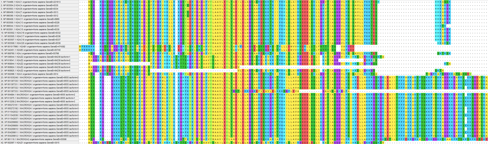
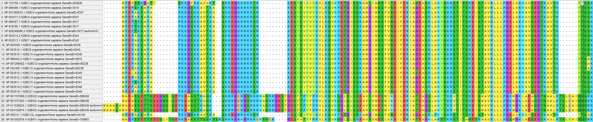
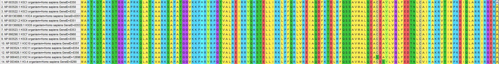
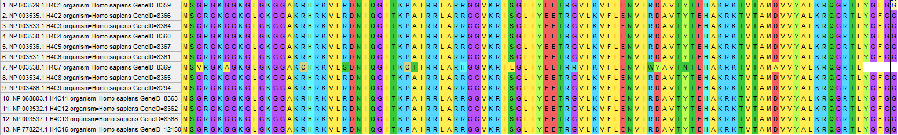

# Индивидуальная часть

Гистоновая метка: **H3K36me**

Выбранный белок: **NSD1**

## Выравнивание гистонов

Выравнивания произведены с помощью программы MEGA X

### H2A

Большинство представленных последовательностей сильно схожи друг с другом, что позволяет считать их кодировкой одного гена. Остальные же последовательности отличаются. Вероятно, это может быть связано с генетическими вариациями, эпигенетическими модификациями, регуляцией экспрессии генов и взаимодействием с другими белками.
### H2B

Как и в предыдущем гистоне, большинство представленных последовательностей сильно похожи друг на друга, что позволяет предположить, что они кодируются одним и тем же геном. Как и в предыдущем гистоне, наличие различий может быть связано с генетическими вариациями, эпигенетическими модификациями, регуляцией экспрессии генов и взаимодействием с другими белками.
### H3

Все последовательности сильно похожи друг на друга, что позволяет предположить, что они кодируются одним и тем же геном.
### H4

Все последовательности сильно похожи друг на друга, что позволяет предположить, что они кодируются одним и тем же геном.

## Работа с blastp
Выбранные аминокислотные последовательности для каждого гистона и белка сохранены в папке data
### E-value

## -log(E-value)

## Тепловая карта

Вывод - белок появился в период одноклеточных эукариот.
